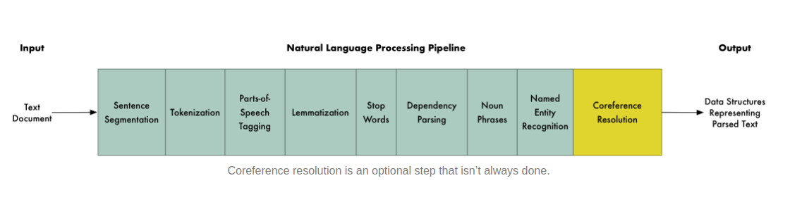

# NLP  

## Question Answering Techniques and Paradigms  

Approaches of Question Classification:  

<b>Manual classification:</b>​ Manual classification applies hand-made rules to identify expected answer types. These rules may be accurate but they are time-consuming, tedious, and non-extensible in nature.  

<b>Automatic classification:</b>​ This type of definition helps on a better answer detection. Automatic classifications, in contrast, are extensible to new questions types with acceptable accuracy.  

## Type of Questions:  

<b>Factoid:</b> ​ Factoid questions are the ones that ask about a simple fact and can be answered in a few words.  

<b>Complex questions:</b>​ Complex Question is about information in a context. Usually, the answer is a merge of retrieved passages.
Examples to implement the above: Normalized Raw-Scoring, Logistic Regression, Round-Robin, Raw Scoring and 2-step RSV.  

<b>List Questions:</b> ​ Demands as an answer a set of entities that satisfies a given criteria.  
Example: When did Brazil win Soccer World Cups? illustrates this point clearly.  
 
<b>Definition questions:</b>​ They expect a summary or a short passage in return
How does the mitosis of a cell work?  

## Types of QA systems can be defined by the paradigm each one implements:

<b>Information Retrieval QA:</b>​ Usage of search engines to retrieve answers and then apply filters and ranking on the recovered passage.  

<b>Natural Language Processing QA:</b>​ Usage of linguistic intuitions and machine learning methods to extract answers from retrieved snippet.  

<b>Knowledge Base QA:</b>​ Find answers from structured data source (a knowledge base) instead of unstructured text. Standard database queries are used in replacement of word-based searches. This paradigm, make use of structured data, such as ontology. An ontology describes a conceptual representation of concepts and their relationships within a specific domain. Ontology can be considered as a knowledge base which has a more sophisticated form than a relational database (Abdi et al., 2016). To execute queries in order to retrieve knowledge from the ontology, structured languages are proposed and one of then is SPARQL.  

<b>Hybrid QA:</b>​ High performance QA systems make use of as many types of resources as possible, especially with the prevailing popularity of modern search engines and enriching community contributed knowledge on the web. A hybrid approach is the combination of IR QA, NLP QA and KB QA. The main example of this paradigm is IBM Watson.  

## Reference material to read:  

1. https://www.semanticscholar.org/paper/A-literature-review-on-question-answering-paradigms-Soares-Parreiras/bf4f4ebd43ac87431fdf978988c2a90b1034e994  
2. https://www.aclweb.org/anthology/S13-1041.pdf  
3. https://arxiv.org/pdf/1905.07098v2.pdf  
4. https://towardsdatascience.com/automatic-question-answering-ac7593432842  
5. nlpprocessing.com  
6. https://medium.com/@ageitgey/natural-language-processing-is-fun-9a0bff37854e  
7. https://github.com/Kyubyong/nlp_tasks (useful github repo)  
8. https://github.com/keon/awesome-nlp#reading-content (useful github repo)   
9. https://arxiv.org/pdf/1801.06287.pdf (Text CNN)  
10. https://arxiv.org/pdf/1808.04926.pdf (How Much Reading Does Reading Comprehension Require?
A Critical Investigation of Popular Benchmarks)  
11. https://arxiv.org/abs/1804.09541 (QA Net)  
12. https://towardsdatascience.com/nlp-building-a-question-answering-model-ed0529a68c54  

## Latest Libraries to have knowledge about related to NLP:  

1. gluonnlp  
2. tqdm  
3. ParlAI  

## Dataset:  

1. SQuAD  
2. MCTest (machine comprehension): It contains 660 stories with 4 questions per story and 4 answer choices per question.  
3. WikiQA: WikiQA is an open domain dataset of question and sentence pairs, collected and annotated for research on open-domain question answering.  
4. CLOZE dataset: to predict a missing word in the passage.  
5. WIKIMOVIES Dataset(220K questions and 18K wikipedia articles)  

## Present Methods of Question-Answer Retrieval:

a) Dynamic Coattention Nets  
b) Multi Perspective Matching  
c) BiDAF  
d) R-Net  
e) DRQA  

## Create embeddings:  

a) Character Embeddings (Char-CNN)  
b) Word Embeddings (GLove)  

## Evaluation Matrices:  

Most of the networks use ESM and F1 score as a matrix for evaluation.  
<b>a) Exact String Match (ESM): </b>​ The target and the generated string must match completely.  
<b>b) F1 score:</b>​ The percentage of generated string words that match with the target words.   

